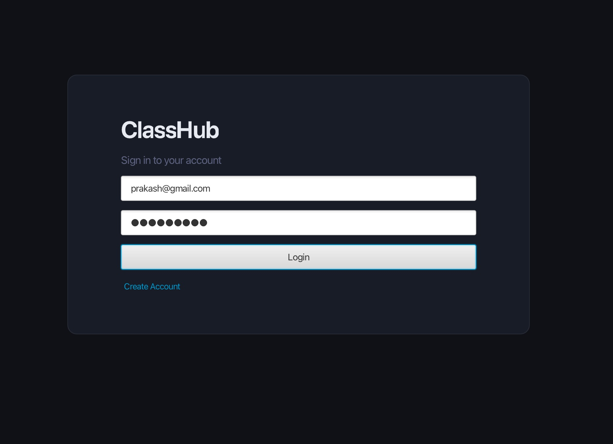
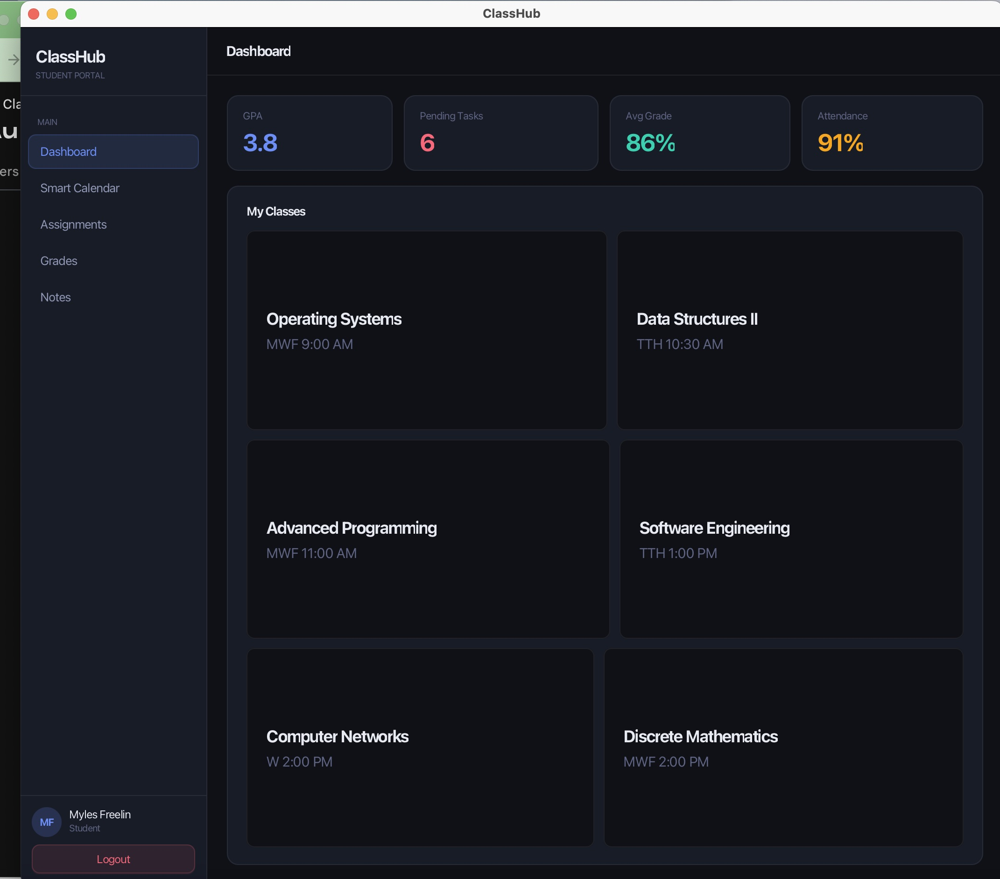
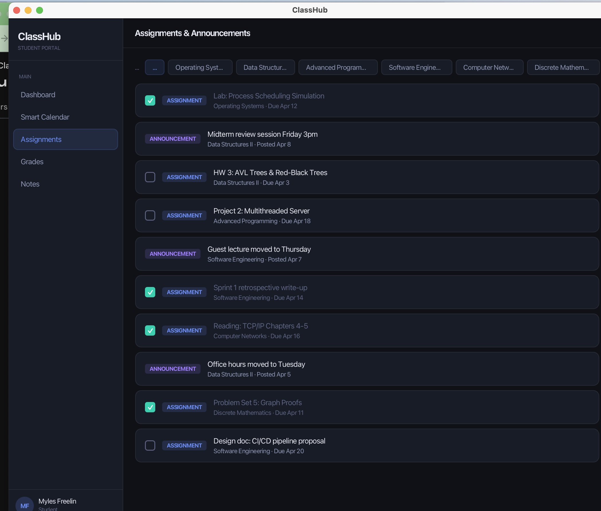
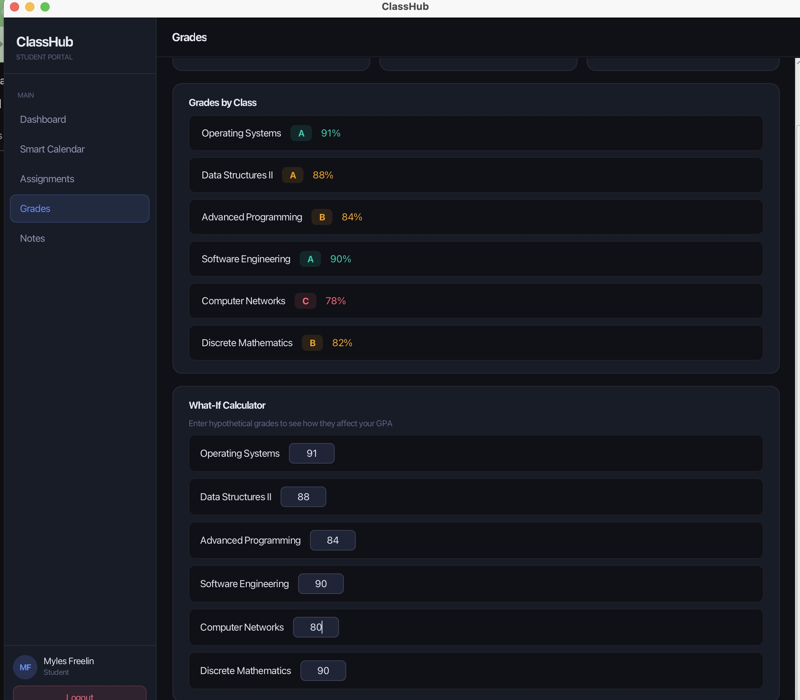
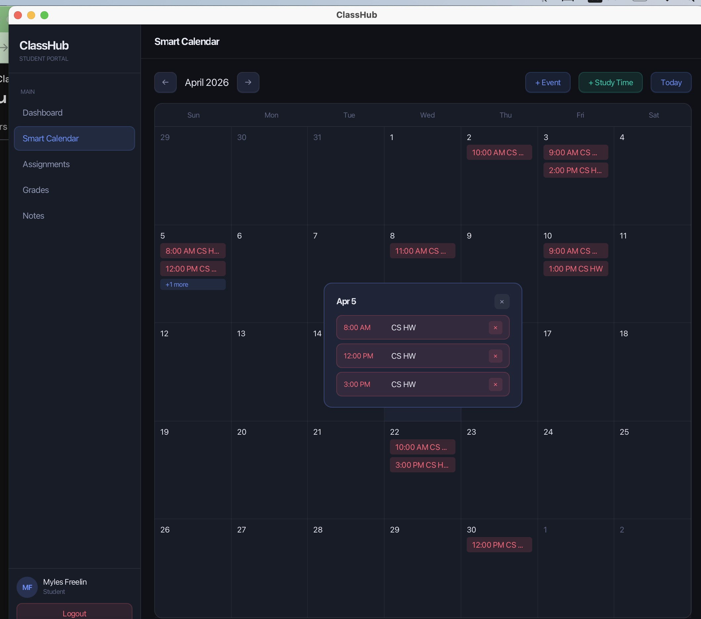
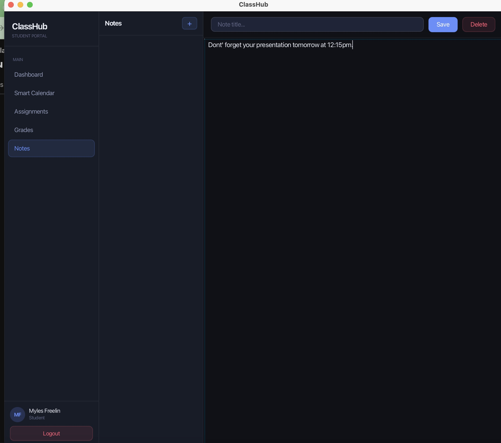

Testing Summary for ClassHub
Environment: macOS 13 (Ventura), Java 25, Spring Boot 3.2.5, Firebase Firestore
Authentication
I tested user registration through the POST /api/auth/register endpoint and it successfully created a new account. Login worked correctly using Firebase email/password authentication, and invalid credentials were properly rejected with an error message. Token verification with the Spring Boot backend also worked as expected.
Dashboard
After logging in, the dashboard loaded correctly showing GPA, Pending Tasks, Average Grade, and Attendance. The My Classes section displayed all enrolled courses properly.
Assignments
The Assignments and Announcements page loaded all items correctly. Filtering by class worked, and the checkboxes for marking assignments as completed were functional.
Grades
Grades were displayed per class with the correct letter grade and percentage. The What-If Calculator allowed me to enter hypothetical grades and see how they would affect the GPA.
Smart Calendar
Events were displayed correctly by date and navigation between months worked. Days with multiple events were expandable to show all items.
Notes
Note creation and editing worked correctly. The Save and Delete buttons functioned as expected.
Issues Found
Port 8080 occasionally conflicted with other processes requiring manual termination before restarting the backend. The Firebase service account key also needs to be manually added locally since it is not included in the repository for security reasons.

## Screenshots

### Login

### Dashboard

### Assignments

### Grades

### Smart Calendar

### Notes
